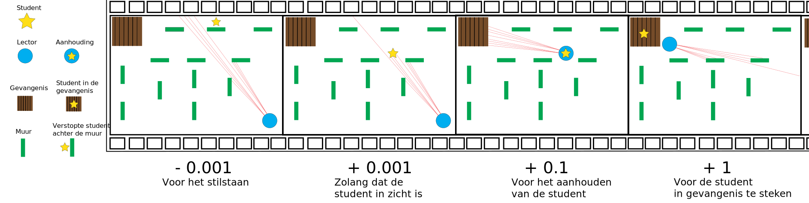

# VerstAPpertje

## 1 Inhoud

- [Inleiding](#2-Inleiding) 
- [Methoden](#3-Methoden)
  - [Samenvatting](#3.1-Samenvatting)
  - [Installatie](#3.2-Installatie)
  - [Spelverloop](#3.3-Spelverloop)
  - [Observaties, mogelijke acties en beloningen](#3.4-Observaties,-mogelijke-acties-en-beloningen)
  - [Gedragingen van de objecten](#3.5-Gedragingen-van-de-objecten)
  - [One-Pager](#3.6-One-Pager)
- [Resultaten](#4-Resultaten)
  - [TensorBoard](#4.1-TensorBoard)
  - [Opvallende waarnemingen](#4.2-Opvallende-waarnemingen)
- [Conclusie](#5-Conclusie)
- [Bronvermelding](#6-bronvermelding)

## 2 Inleiding

Het algemeen idee van VerstAPpertje is een Virtual Reality Ervaring te creëren waarin een speler verstoppertje kan spelen in een 3D-wereld die gebaseerd is op de gebouwen van AP.
De zoeker is een intelligente agent welke op voorhand getraind is om de speler te zoeken en vervolgens deze op te sluiten in het gevang.

Hieronder een ruwe voorstelling van het beloningssysteem dat gebruikt wordt om de zoeker te trainen.



## 3 Methoden

### 3.1 Samenvatting

In dit document zullen alle stappen om dit project te realiseren worden toegelicht. Na het lezen hiervan zal de lezer in staat zijn om zelf een VR Ervaring ondersteund door ML te creëren met behulp van Unity, ML Agents, XR Interaction Toolkit & Oculus XR Plugin.

### 3.2 Installatie

Voor we kunnen starten met de ontwikkeling van het project, hebben we bepaalde software nodig.

- [Unity 2019.4.10](https://unity3d.com/unity/whats-new/2019.4.10)
  - [ML agents 1.0.5](https://docs.unity3d.com/Packages/com.unity.ml-agents@1.0/manual/index.html)
  - Oculus XR Plugin 1.4.3
  - Windows XR Plugin 2.3.0
  - XR Interaction Toolkit preview - 0.9.4
  - XR Plugin Management
  - TextMeshPro 2.1.1
- [Python 3.7.9](https://chocolatey.org/packages/python/3.7.9)
  - [ML agents 0.20.0](https://pypi.org/project/mlagents/0.20.0/)
  - [Tensorboard 2.3.0](https://pypi.org/project/tensorboard/2.3.0/)

### 3.3 Spelverloop

Wanneer het spel start, zal de speler op een willekeurig `spelersspawnplatform` (groen) worden gespawnd. Tegelijkertijd zal ook de zoeker op een daarvoor bestemd platform (rood) worden gespawnd. De speler heeft dan de mogelijkheid om rond te lopen in het speelveld en zich zo goed mogelijk te verstoppen. De zoeker zal trachten de speler te vinden. De zoeker is zoals eerder vermeld een agent die op voorhand wordt getraind.
Wanneer de speler gevonden en gepakt wordt door de zoeker, zal de zoeker deze verplaatsen richting de gevangenis. Eens deze aan de gevangenis gearriveerd is, wordt de speler hierin opgesloten. Dit is dan ook het einde van het spel. Het doel van de speler is om zo lang mogelijk uit de handen van de zoeker te blijven.

### 3.4 Observaties, mogelijke acties en beloningen

In dit project maken wij gebruik van reinforcement learning om de ML Agents op een correcte wijze te laten leren. Dit doen wij door gebruik te maken van zowel intrinsieke- als extrinsieke beloningen. Extrinsieke beloningen zijn beloningen die door ons worden gedefinieerd. Intrinsieke beloningen bepalen dan weer de nieuwsgierigheid van de ML Agents en hoe snel hij iets moet leren.

Doordat de Zoeker en de Speler gemeenschappelijke gedragingen hebben (zie hoofdstuk `'Gedragingen van de objecten'`), worden deze in een superclasse gebruikt waar beiden van zullen overerven. Zo zullen ze beiden telkens gestraft of beloond worden per actie die ze ondernemen. Echter delen zij acties die leiden tot gemeenschappelijke beloningen.

Aangezien de Zoeker het belangrijkst object is van dit project, zal hij ook meer worden beloond en afgestraft voor de acties die het zal ondernemen. 

| Omschrijving | Beloning (floats) |
|-|-|
| 

### 3.4 Beschrijvingen van de objecten


Bovenstaande afbeelding geeft ons een top-down view van het volledige speelveld. We zien hier een aantal belangrijke elementen voor zowel de speler als de intelligente agent die als zoeker zal fungeren.

Over het hele speelveld zien we dat er een aantal deuren zijn verspreid. De speler kan van deze deuren handig gebruik maken om zich beter te verstoppen voor de zoeker. De zoeker zal dan de deur moeten openen om de speler te kunnen zien. Om ervoor te zorgen dat de speler hier niet té veel voordeel uit kan halen, is er bij elke kamer die een deur bevat slechts één deur voorzien, zodat de speler niet gewoon kan wachten tot de deur opengaat en dan de andere uitweg nemen.


Bepaalde lokalen zijn enkel toegankelijk via een deur. Deze kunnen op twee manieren worden geopend. De eerste manier maakt gebruik van grabables aan de hendels. De speler kan deze hendels vastnemen en zo de deur opentrekken of openduwen. De tweede manier is om ertegenaan te lopen. Hierbij zal de deur op een realistische manier worden opengeduwd.


Wanneer een speler gevangen wordt door de zoeker, wordt deze in dehttps://prod.liveshare.vsengsaas.visualstudio.com/join?FC32142D06BC00DD6F842CF12C815148E12C gevangenis opgesloten. Dit gebeurt simpelweg door de collider van de speler tegen de collider van de gevangenis aan te tikken.


De speler is in staat om zichzelf naar voor, achter, links en rechts te verplaatsen. Ook kan deze rond de X-as roteren. Zoals hierboven vermeld is er ook een interactie tussen de speler en de deuren. Deze kunnen geopend en gesloten worden. Uiteindelijk is er nog de interactie met de gevangenis. Wanneer de speler de gevangenis aanraakt, zal het spel eindigen.

### 3.5 Gedragingen van de objecten

#### Zoeker


De zoeker is, net zoals de speler, in staat om zichzelf naar voor, achter, links en rechts te verplaatsen en deze kan ook rond de X-as roteren. Ook heeft de zoeker de mogelijkheid om deuren te openen en te sluiten.

De zoeker heeft echter twee ogen met 3D Ray Perception Sensors. Deze zijn in staat om alle objecten met een tag te observeren. Wanneer de Ray Perception Sensors de speler zien, zou de zoeker (in theorie) zich richting de speler moeten verplaatsen, deze "vastnemen", en deze naar de gevangenis brengen. Het vastnemen van de speler doet de zoeker door simpelweg tegen de speler aan te lopen.

Hoewel de speler in het uiteindelijke spel door een persoon zal worden gespeeld, zal deze in de trainingsfase ook worden aangedreven door een intelligente agent. Beide agents worden dus als het ware tegen elkaar opgezet en moeten beiden zo goed mogelijk hun eigen taak uitvoeren. De agent van de speler moet uit de handen van de zoeker proberen te blijven, terwijl de zoeker de speler moet vangen en deze opsluiten in de gevangenis.

Het beloningssysteem achter de zoeker en de speler wordt aangedreven door code. Aangezien beiden redelijk gelijkaardig zijn in wat ze kunnen doen, erven ze alletwee over van dezelfde superklasse: MovingObject.

```csharp
public abstract class MovingObject : Agent
    {
        [Header("Settings")]
        public float movementSpeed = 2f;
        public float rotationSpeed = 5f;

        public Classroom Classroom { get; set; }
        protected Rigidbody rbody;
        protected GameObject jailFloor;

        public override void Initialize()
        {
            Classroom = GetComponentInParent<Classroom>();
            rbody = GetComponent<Rigidbody>();
            rbody.angularVelocity = Vector3.zero;
            rbody.velocity = Vector3.zero;
            rbody.angularDrag = 50;
        }

        protected virtual void FixedUpdate()
        {
            RequestDecision();
        }

        public override void Heuristic(float[] actionsOut)
        {
            actionsOut[0] = 0f;
            actionsOut[1] = 0f;
            actionsOut[2] = 0f;
            actionsOut[3] = 0f;
            actionsOut[4] = 0f;
            actionsOut[5] = 0f;

            if (Input.GetKey(KeyCode.UpArrow))
            {
                actionsOut[0] = 2f;
            }
             if (Input.GetKey(KeyCode.DownArrow))
            {
                actionsOut[1] = 1f;
            }
             if (Input.GetKey(KeyCode.LeftArrow))
            {
                actionsOut[2] = 1f;
            }
             if (Input.GetKey(KeyCode.RightArrow))
            {
                actionsOut[3] = 1f;
            }
             if (Input.GetKey(KeyCode.D))
            {
                actionsOut[4] = 1f;
            }
             if (Input.GetKey(KeyCode.A))
            {
                actionsOut[5] = 1f;
            }
        }

        public override void OnActionReceived(float[] vectorAction)
        {
            if (vectorAction[0] > 0.5f)
            {
                Vector3 rightVelocity = new Vector3(movementSpeed * vectorAction[0], 0f, 0f);
                rbody.velocity = rightVelocity;
            }
            if (vectorAction[1] > 0.5f)
            {
                Vector3 leftVelocity = new Vector3(-movementSpeed * vectorAction[1], 0f, 0f);
                rbody.velocity = leftVelocity;
            }
            if (vectorAction[2] > 0.5f)
            {
                Vector3 rightVelocity = new Vector3(0f, 0f, movementSpeed * vectorAction[2]);
                rbody.velocity = rightVelocity;
            }
            if (vectorAction[3] > 0.5f)
            {
                Vector3 leftVelocity = new Vector3(0f, 0f, -movementSpeed * vectorAction[3]);
                rbody.velocity = leftVelocity;
            }

            if (vectorAction[4] > 0f)
            {
                transform.Rotate(0f, (vectorAction[4] * rotationSpeed) * Time.deltaTime, 0f);
            }
            else if (vectorAction[5] > 0f)
            {
                transform.Rotate(0f, (vectorAction[5] * rotationSpeed) * Time.deltaTime * -1, 0f);
            }
        }
    }
```

Het script dat de zoeker aandrijft:
```csharp
public class Seeker : MovingObject
    {
        public Player CapturedPlayer { get; set; }
        public bool HasPlayerGrabbed { get; set; }
        public int PlayerCount { get; set; }
        public int PlayersCaptured { get; set; }

        public override void CollectObservations(VectorSensor sensor)
        {
            base.CollectObservations(sensor);

            sensor.AddObservation(HasPlayerGrabbed);
        }

        protected override void FixedUpdate()
        {
            base.FixedUpdate();

            if (CapturedPlayer != null && CapturedPlayer.IsGrabbed && !CapturedPlayer.IsJailed)
            {
                TransportPlayer();
            }

        }

        private void TransportPlayer()
        {
            if (CapturedPlayer != null)
            {
                CapturedPlayer.transform.position = new Vector3(transform.position.x, transform.position.y + 2, transform.position.z);
            }
        }

        public override void OnActionReceived(float[] vectorAction)
        {
            base.OnActionReceived(vectorAction);

            if (vectorAction[0] == 0f && vectorAction[1] == 0f && vectorAction[2] == 0f && vectorAction[3] == 0f && vectorAction[4] == 0f && vectorAction[5] == 0f)
            {
                // Stilstaan & niet rondkijken samen zorgt voor afstraffing.
                AddReward(-0.001f);
            }
        }

        public override void OnEpisodeBegin()
        {
            Classroom = GetComponentInParent<Classroom>();

            if (Classroom != null)
            {
                Classroom.ClearEnvironment();
                Classroom.ResetSpawnSettings();
                Classroom.SpawnPlayers();
                Classroom.SpawnSeekers();
                PlayerCount = Classroom.playerCount;
            }

            PlayersCaptured = 0;
            HasPlayerGrabbed = false;
            CapturedPlayer = null;
        }

        protected void OnCollisionEnter(Collision collision)
        {
            Transform collObject = collision.transform;

            if (collObject.CompareTag("Player"))
            {
                if (!HasPlayerGrabbed)
                {
                    HasPlayerGrabbed = true;

                    CapturedPlayer = collObject.gameObject.GetComponent<Player>();
                    if (CapturedPlayer != null && !CapturedPlayer.IsJailed)
                    {
                        CapturedPlayer.IsGrabbed = true;
                        CapturedPlayer.CapturedBy = this;
                        CapturedPlayer.AddReward(-1f);
                        AddReward(0.5f);
                    }
                }
                else
                {
                    // Afstraffen voor tegen een Player te botsen als die er al eentje vastheeft.
                    AddReward(-0.1f);
                }
            }
            else if (collObject.CompareTag("JailFloor"))
            {
                EndEpisode();
            }
        }

        public void EndEpisodeLogic()
        {
            if (PlayersCaptured == PlayerCount)
            {
                // Eindig episode als alle players worden gevangen.
                EndEpisode();
            }
        }

        public void ClearCapturedPlayer()
        {
            PlayersCaptured++;
            AddReward(1f);
            HasPlayerGrabbed = false;
            CapturedPlayer = null;
            EndEpisodeLogic();
        }
    }
```

Het script dat de speler aandrijft:
```csharp
    public class Player : MovingObject
    {
        public bool IsJailed { get; set; }
        public bool IsGrabbed { get; set; }
        public Seeker CapturedBy { get; set; }
        public override void CollectObservations(VectorSensor sensor)
        {
            base.CollectObservations(sensor);

            sensor.AddObservation(IsJailed);
            sensor.AddObservation(IsGrabbed);
        }

        protected override void FixedUpdate()
        {
            base.FixedUpdate();
        }

        public override void OnActionReceived(float[] vectorAction)
        {
            if (!IsGrabbed)
            {
                base.OnActionReceived(vectorAction);
            }
        }

        public void CapturedLogic()
        {
            IsJailed = true;
            IsGrabbed = false;
            CapturedBy.HasPlayerGrabbed = false;
            CapturedBy = null;
        }
    }
```

### 3.6 One-Pager

#### 3.6.1 Inleiding

Het algemeen idee is om een Virtual Reality Ervaring te maken waarin de gebruiker verstoppertje kan spelen in een 3D-wereld gebaseerd op de gebouwen van AP. De speler zelf zal zich altijd moeten verstoppen, terwijl een intelligente agent hem zal trachten te vinden. 

#### 3.6.2 AI Component

Zonder de AI-component zal het onmogelijk zijn voor de zoeker om de verstopper snel te vinden. Hiervoor zal 
de agent gebruik maken van de aanwijzingen. Ook is deze belangrijk om van ons spel een soloplayer avontuur 
te kunnen maken. Anders zal elke verstopper afhankelijk zijn van een tweede partij, nl. de zoeker.  
Met een AI-Component zal de “zoeker” met behulp van Ray Perception Sensors studenten kunnen zien, welke 
deuren er openstaan, welke stoelen er verplaatst zijn, etc. 
Wij opteren hierbij voor een Single-Agent aangezien er slechts één zoeker zal zijn. 

#### 3.6.3 Interacties

De “zoeker” van het spel zal gespeeld worden door een Intelligence Agent. Zoals een gewone speler zal deze 
getraind worden om bepaalde geluiden en visuele aanwijzingen te gebruiken om de “verstopper” te vinden. 
De agent zal dankzij het Ray Perception 3D component de mogelijkheid hebben om andere gameobjects met 
op voorhand ingestelde tags te zien. 
De enige virtueel fysieke interactie tussen de agent en de speler zal zijn wanneer de speler gevonden wordt. De 
speler wordt dan meegenomen naar de gevangenis door de agent, waar hij opgesloten zal worden. 

## 4 Resultaten

### 4.1 TensorBoard

### 4.2 Opvallende waarnemingen

Om de zoeker aan te leren dat hij naar een speler moest zoeken, moest er ook een speler Agent aangemaakt worden die zich zou kunnen verstoppen. Op een gegeven moment was de Agent van de speler te slim geworden voor de Agent van de zoeker. Dit zorgde ervoor dat de snelle vooruitgang van de Seeker werd belemmerd.

Zowel de speler als de zoeker had een manier gevonden om in de gevangenis te geraken zonder het beoogde spelverloop hierbij te volgen. De speler kon op een onvoorspelde manier de gevangenis in. Dit zorgde ervoor dat hij veilig was van de zoeker. De speler daarentegen ging rechtstreeks richting de gevangenis. Hierdoor kon hij de episode eindigen alvorens hij afgestraft werd voor strafbaar gedrag. Op deze manier waren zijn scores hoger dan dat hij zou zoeken en zo punten zou verliezen.

Elke keer dat er gedacht werd dat alle bugs uit de applicatie waren, vonden de speler en zoeker toch nog een manier om een bug te abusen. Dit maakte het extra moeilijk om te trainen.


## 5 Concusie

Wij als groep hebben een VR applicatie gemaakt voor een enkele speler die een soort "verstoppertje" nabootst, genaamd verstAPpertje.

*resultaten*

Door het hierboven vermelde fenomeen werd het enorm moeilijk voor de zoeker om bij te leren. Dit, in combinatie met een niet geoptimaliseerd beloningssysteem, zorgt ervoor dat we in onze beperkte ontwikkelingstijd geen feilloze agents hebben kunnen trainen.

Het grootste probleem van deze opdracht was de gelimiteerde tijdsspanne. Dit zorgde ervoor dat de Agent niet de kans had om volledig te ontwikkelen. Enkele voorgestelde verbeteringen hiervoor zijn: het beloningssysteem nog verder optimaliseren, de agent nog meer tijd geven om bij te leren of een supercomputer gebruiken zodat de berekeningen sneller gaan.

## 6 Bronvermelding
VR with Andrew (Mar 18, 2020) Moving in VR using Unity's XR Toolkit [01] and Moving in VR using Unity's XR Toolkit [02]  Opgehaald van
1. https://www.youtube.com/watch?v=6N__0jeg6k0 

2. https://www.youtube.com/watch?v=X2QYjhu4_G4  

How to make a door in VR - Unity tutorial (Aug 21, 2019) by Valem opgehaald van https://www.youtube.com/watch?v=3cJ_uq1m-dg
